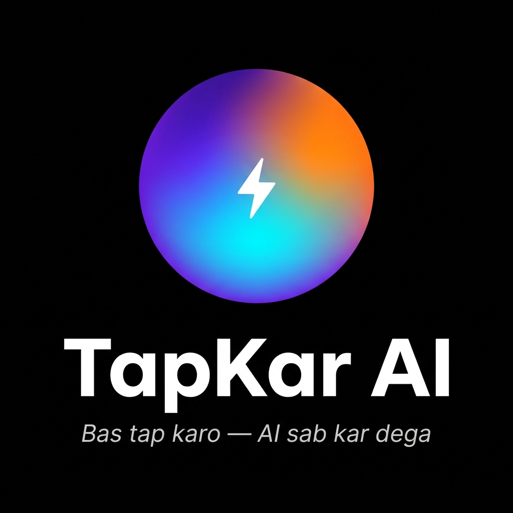

# TapKar AI

<p align="center">
  
</p>

> ### *"Bas tap karo — AI sab kar dega."*
> **Just tap. The AI does everything.**

**AI SEEKHO Phase 2 Hackathon · Challenge 2** · Built with Google Antigravity

**TapKar AI** (ٹیپ کر — "just tap and it's done") is an agentic mobile assistant that turns a casual voice or text message — in Urdu, Roman Urdu, or English — into a confirmed booking with a verified service provider (plumber, electrician, tutor, beautician, AC technician, and 20+ more). TapKar AI is all it takes — the AI agents handle the rest: understanding, discovery, ranking, booking, and follow-up. Zero hardcoded business logic.

---

## The problem

Pakistan's informal economy runs on WhatsApp messages, phone calls, and word-of-mouth referrals. Finding a reliable plumber at 11 PM, a tutor for tomorrow morning, or a beautician for a wedding next week means:

- Asking random WhatsApp groups
- Waiting hours for a referral
- No real ratings, no verified availability, no accountability
- Roman Urdu / Urdu / English mixed input nobody can parse cleanly

**~70% of Pakistan's workforce sits in this informal layer.** They're invisible to platforms — and platforms are useless to them.

## The solution

A single agentic system that:

1. **Understands** natural language requests in all three languages (no translation step)
2. **Discovers** matching providers from a mock pool + Google Places API
3. **Ranks** intelligently — distance, rating, availability, price — explaining every decision
4. **Books** with confirmation messages in the user's own language
5. **Follows up** with reminders, status checks, and post-service surveys

All of this driven by reasoning agents — not hardcoded if/else logic.

There are two ways to talk to TapKar AI:

- **Chat mode** — type, speak (push-to-talk Urdu STT), or attach photos. Trace panel shows each agent step live as an SSE stream.
- **Voice mode** — Gemini Live full-duplex audio. Tap the orb, speak naturally; the Live model interprets the request and calls our 5-agent pipeline as a tool. Booking outcome is narrated back in the same language. The trace panel still updates in the background.

## Architecture (at a glance)

```
[Flutter Mobile App] ──HTTPS──> [Backend on Cloud Run · code authored in Antigravity IDE]
                                       │
                                       └─► Orchestrator  (TypeScript loop → Gemini API)
                                             │
                                             │   Per the hackathon clarification: Antigravity
                                             │   is the DEV IDE only. The deployed product
                                             │   has its own agent loop and depends only on
                                             │   a Gemini API key — not on Antigravity.
                                             │
                                             ├─► Intent Agent      (Gemini API call)
                                             ├─► Discovery Agent   (Gemini API call)
                                             ├─► Ranking Agent     (Gemini API call)
                                             ├─► Booking Agent     (Gemini API call)
                                             └─► Follow-up Agent   (Gemini API call)
                                       │
                                Firestore + Maps + Cloud STT
```

There's also a web **Admin Dashboard** served from the same backend at `/admin/dashboard` — operational view of users, providers, and bookings.

## Anti-monolithic by design

> No `rankProviders()`. No `matchCategory()`. No `if (category === 'plumber')`. Every business decision is an LLM call. Tools are dumb I/O. Adding a service category = adding a row to `data/taxonomy.json`.

This is enforced as a project principle, not just a coding style.

## Languages supported

| Language | Status | Example |
|---|---|---|
| English | ✅ | "Need a plumber in Gulshan tomorrow morning" |
| Roman Urdu | ✅ | "kal subah Gulshan mein plumber chahiye" |
| Urdu (Nastaliq) | ✅ | "کل صبح گلشن میں پلمبر چاہیے" |
| Code-switching | ✅ | "kal AC repair karwana hai, achha wala banda bhejo" |

## Service coverage

32 service categories across 3 tiers — see [`data/taxonomy.json`](data/taxonomy.json) for the full list. Open-domain fallback via Google Places API for anything not in the taxonomy.

## Tech stack

| Layer | Choice | Why |
|---|---|---|
| Mobile | **Flutter** | Google's framework · single codebase Android/iOS · strong Urdu rendering |
| Backend | **Cloud Run + TypeScript** | Authored entirely in Antigravity · easy Firestore + Maps integration |
| Orchestration | **Google Antigravity** | Mandatory · multi-agent runtime · produces submission-required artifacts |
| LLM | **Gemini 2.5 Flash / Flash-Lite** (default) + **Gemini Live** (voice) | Single Gemini API key for chat + voice; Live model orchestrates the 5-agent pipeline as a tool |
| Data | **Firestore** + mock JSON | Free tier for hackathon · trace logs written here |
| Maps | **Google Places API + Geocoding** | Real provider discovery with mock fallback |
| Voice (chat) | **Cloud Speech-to-Text** (Urdu) | Native mobile STT better than browser API |
| Voice (live) | **Gemini Live (native audio)** over WebSocket | Real-time voice mode — model calls our 5-agent pipeline as a single tool, streams agent traces + audio back to the client |

## Repo layout

```
google_challange2/
├── README.md                   ← you are here
├── Dockerfile                  ← Cloud Run container build
├── deploy.sh                   ← one-shot deploy script
├── data/
│   ├── taxonomy.json           ← service categories + multilingual synonyms
│   └── providers.karachi.json  ← seed mock providers
├── branding/                   ← brand assets (logo)
├── backend/
│   └── src/
│       ├── admin.html          ← admin dashboard (served at /admin/dashboard)
│       ├── agents/             ← prompt specs for orchestrator + 5 subagents
│       └── tools/              ← thin TypeScript I/O wrappers
└── mobile/                     ← Flutter app
```

## Team

**Saifullah** + **Haris** · Karachi regional round.

## License

Hackathon submission — see Google AI SEEKHO Phase 2 terms.
